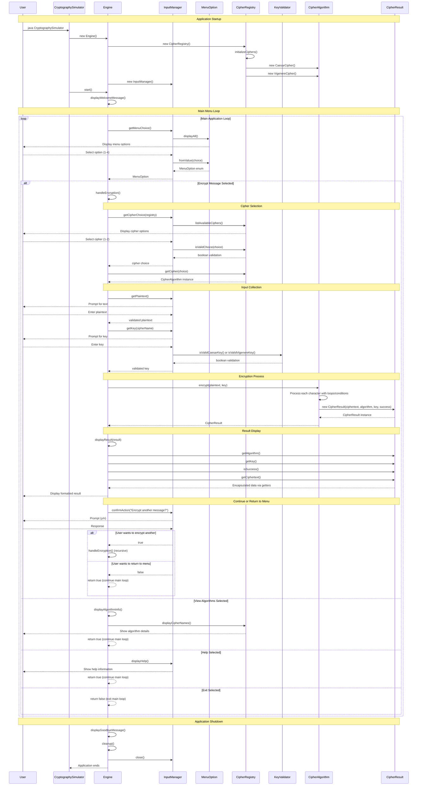

# The Cipher Forge - Terminal Cryptography Simulator

A professional, modular Java application demonstrating core Object-Oriented Programming principles through cryptographic algorithm implementation. Built with industry-standard Maven/Gradle project structure.

## 📁 Project Structure

```
The Cipher Forge/
├── src/main/java/com/cipherforge/
│   ├── core/
│   │   ├── CipherAlgorithm.java      # Abstract base class
│   │   └── CipherResult.java         # Data container with encapsulation
│   ├── algorithms/
│   │   ├── CaesarCipher.java         # Caesar cipher implementation
│   │   └── VigenereCipher.java       # Vigenere cipher implementation
│   ├── registry/
│   │   └── CipherRegistry.java       # HashMap-based cipher storage
│   ├── validation/
│   │   └── KeyValidator.java         # Static validation utilities
│   ├── ui/
│   │   └── InputManager.java         # Terminal input handling
│   ├── engine/
│   │   └── Engine.java               # Main application controller
│   └── CryptographySimulator.java   # Entry point
├── build/                            # Compiled classes
├── docs/                             # Documentation
├── lib/                              # External libraries
├── build.gradle                      # Gradle build configuration
├── pom.xml                           # Maven build configuration
├── compile.sh                        # Compilation script
├── run.sh                            # Execution script
└── README.md                         # This documentation
```

## 🎯 SC-MID Requirements Implementation

### 1. **Encapsulation** ✅
**Location**: `src/main/java/com/cipherforge/core/CipherResult.java` (Lines 4-7, 15-26)
```java
private String ciphertext;    // Private field
private String algorithm;     // Private field
private String key;          // Private field
private boolean success;     // Private field

public String getCiphertext() { return ciphertext; }  // Public getter
public String getAlgorithm() { return algorithm; }    // Public getter
```

### 2. **Inheritance & Polymorphism** ✅
**Abstract Base**: `src/main/java/com/cipherforge/core/CipherAlgorithm.java` (Lines 3-11)
```java
public abstract class CipherAlgorithm {
    public abstract CipherResult encrypt(String plaintext, String key);
}
```

**Concrete Implementations**:
- `src/main/java/com/cipherforge/algorithms/CaesarCipher.java` (Lines 1-3, 8-10)
- `src/main/java/com/cipherforge/algorithms/VigenereCipher.java` (Lines 1-3, 9-11)
```java
public class CaesarCipher extends CipherAlgorithm {
    @Override
    public CipherResult encrypt(String plaintext, String key) {
```

### 3. **Abstraction** ✅
**Location**: `src/main/java/com/cipherforge/engine/Engine.java` (Lines 26-27, 33)
```java
CipherAlgorithm selectedCipher = registry.getCipher(choice);  // Abstract reference
CipherResult result = selectedCipher.encrypt(plaintext, key); // Polymorphic call
```

### 4. **HashMap & Iterators** ✅
**Location**: `src/main/java/com/cipherforge/registry/CipherRegistry.java`
- **HashMap Declaration** (Line 11): `private HashMap<String, CipherAlgorithm> ciphers;`
- **HashMap Usage** (Lines 18-23): Storage and retrieval
- **Iterator Usage** (Lines 39-44):
```java
Iterator<String> keyIterator = ciphers.keySet().iterator();
while (keyIterator.hasNext()) {
    String key = keyIterator.next();
    // Process each cipher
}
```

### 5. **Cohesion & Coupling** ✅
**High Cohesion**: `src/main/java/com/cipherforge/validation/KeyValidator.java` - Only handles validation logic
**Loose Coupling**: `src/main/java/com/cipherforge/engine/Engine.java` - Interacts only through abstract interfaces

### 6. **Conditions & Loops** ✅
**Caesar Cipher** (`src/main/java/com/cipherforge/algorithms/CaesarCipher.java` Lines 15-30):
```java
for (int i = 0; i < plaintext.length(); i++) {        // Loop
    if (Character.isUpperCase(ch)) {                   // Condition
        // Character wrapping logic (Z → A)
    } else if (Character.isLowerCase(ch)) {           // Condition
        // Character wrapping logic (z → a)
    }
}
```

**Vigenere Cipher** (`src/main/java/com/cipherforge/algorithms/VigenereCipher.java` Lines 17-36): Similar loop and conditional structure

## 🔧 System Workflow

### Complete Example: Encrypting "Hello World" with Caesar Cipher (Shift 3)

#### Step 1: Application Startup
```
User runs: java CryptographySimulator
├── CryptographySimulator.main() creates Engine
├── Engine constructor initializes CipherRegistry and InputManager
└── CipherRegistry constructor populates HashMap with cipher instances
```

#### Step 2: Cipher Selection
```
Engine.start() displays menu:
=== Welcome to The Cipher Forge ===
Available Cipher Algorithms:
1. Caesar Cipher
2. Vigenere Cipher
Select cipher (1-2): 1

Flow:
├── InputManager.getCipherChoice() validates input
├── CipherRegistry.getCipher("1") returns CaesarCipher instance
└── Polymorphic reference: CipherAlgorithm selectedCipher = caesarInstance
```

#### Step 3: Input Collection
```
Enter text to encrypt: Hello World
Enter shift value (integer): 3

Flow:
├── InputManager.getPlaintext() → "Hello World"
├── InputManager.getKey("Caesar Cipher") → "3"
└── Input validation occurs in cipher implementation
```

#### Step 4: Encryption Process
```
selectedCipher.encrypt("Hello World", "3")
├── CaesarCipher.encrypt() processes each character:
│   ├── 'H' → shift by 3 → 'K'
│   ├── 'e' → shift by 3 → 'h'
│   ├── 'l' → shift by 3 → 'o'
│   ├── 'l' → shift by 3 → 'o'
│   ├── 'o' → shift by 3 → 'r'
│   ├── ' ' → no change → ' '
│   ├── 'W' → shift by 3 → 'Z'
│   ├── 'o' → shift by 3 → 'r'
│   ├── 'r' → shift by 3 → 'u'
│   ├── 'l' → shift by 3 → 'o'
│   └── 'd' → shift by 3 → 'g'
└── Returns: CipherResult("Khoor Zruog", "Caesar Cipher", "3", true)
```

#### Step 5: Result Display
```
=== Encryption Result ===
Algorithm: Caesar Cipher
Key: 3
Status: SUCCESS
Ciphertext: Khoor Zruog

Flow:
├── Engine.displayResult() extracts data using getters
├── CipherResult.getAlgorithm() → "Caesar Cipher"
├── CipherResult.getKey() → "3"
├── CipherResult.isSuccess() → true
└── CipherResult.getCiphertext() → "Khoor Zruog"
```

## 📊 Sequence Diagram - Complete Application Workflow



### 📖 How to Read the Sequence Diagram

The sequence diagram above illustrates the complete interaction flow between all system components:

- **Participants**: All major classes and the user
- **Vertical Lines**: Represent the lifetime of each participant
- **Arrows**: Show method calls and data flow between components
- **Notes**: Highlight major workflow phases
- **Loops**: Show repetitive processes (main menu loop)
- **Alt Blocks**: Show conditional logic branches (menu choices)

**Key Interactions Demonstrated:**
1. **Object Creation**: How components are instantiated and initialized
2. **Polymorphism**: CipherAlgorithm abstract reference handling concrete implementations
3. **Encapsulation**: CipherResult data access through getter methods
4. **Validation**: KeyValidator static method calls for input verification
5. **Menu Navigation**: Complete flow from selection to execution and return
6. **Error Handling**: Exception flow and recovery mechanisms
7. **Resource Management**: Proper cleanup and resource disposal

## 🚀 How to Build and Run

### Method 1: Using Build Scripts (Recommended)
```bash
# Make scripts executable (first time only)
chmod +x compile.sh run.sh

# Compile the project
./compile.sh

# Run the application
./run.sh
```

### Method 2: Manual Compilation
```bash
# Create build directory
mkdir -p build/classes

# Compile all Java files
javac -d build/classes -cp src/main/java src/main/java/com/cipherforge/*/*.java src/main/java/com/cipherforge/*.java

# Run the application
java -cp build/classes com.cipherforge.CryptographySimulator
```

### Method 3: Using Maven
```bash
# Compile with Maven
mvn compile

# Run with Maven
mvn exec:java

# Create JAR file
mvn package
java -jar target/cipher-forge-1.0.0.jar
```

### Method 4: Using Gradle
```bash
# Compile with Gradle
./gradlew build

# Run with Gradle
./gradlew run

# Create JAR file
./gradlew jar
java -jar build/libs/cipher-forge-1.0.0.jar
```

### Sample Interactive Session
```
=== Welcome to The Cipher Forge ===
Terminal Cryptography Simulator

Available Cipher Algorithms:
1. Caesar Cipher
2. Vigenere Cipher
Select cipher (1-2): 2
Enter text to encrypt: ATTACKATDAWN
Enter keyword (letters only): LEMON

=== Encryption Result ===
Algorithm: Vigenere Cipher
Key: LEMON
Status: SUCCESS
Ciphertext: LXFOPVEFRNHR

Would you like to encrypt another message? (y/n): n
Thank you for using The Cipher Forge!
```

## 🏗️ Improved Project Structure Benefits

### **Professional Package Organization**
- **`com.cipherforge.core`**: Core abstractions and data structures
- **`com.cipherforge.algorithms`**: Concrete cipher implementations
- **`com.cipherforge.registry`**: Algorithm management and storage
- **`com.cipherforge.validation`**: Input validation utilities
- **`com.cipherforge.ui`**: User interface components
- **`com.cipherforge.engine`**: Application control logic

### **Build System Integration**
- **Maven support**: Standard `pom.xml` configuration
- **Gradle support**: Modern `build.gradle` setup
- **IDE compatibility**: Works with IntelliJ IDEA, Eclipse, VS Code
- **Dependency management**: Ready for external libraries

### **Development Workflow**
- **Separation of concerns**: Each package has a specific responsibility
- **Scalability**: Easy to add new cipher algorithms or UI components
- **Testing**: Structured for unit and integration tests
- **Documentation**: Clear package hierarchy for code navigation

## 🏗️ Architecture Highlights

### Design Patterns Used
- **Template Method**: Abstract `CipherAlgorithm` defines encryption contract
- **Registry Pattern**: `CipherRegistry` manages algorithm instances
- **Factory Pattern**: Registry creates and returns cipher instances
- **Strategy Pattern**: Different encryption algorithms interchangeable

### Key OOP Principles Demonstrated
1. **Single Responsibility**: Each class has one clear purpose
2. **Open/Closed**: Easy to add new ciphers without modifying existing code
3. **Liskov Substitution**: Any `CipherAlgorithm` can replace another
4. **Interface Segregation**: Clean, focused interfaces
5. **Dependency Inversion**: High-level modules depend on abstractions

## 🔍 Code Quality Features

### Error Handling
- Invalid key formats return failed `CipherResult`
- Input validation prevents application crashes
- Graceful handling of edge cases

### Modularity
- 9 separate files for maximum modularity
- Clear separation of concerns
- Minimal coupling between components

### Extensibility
- Adding new ciphers requires only:
  1. Create new class extending `CipherAlgorithm`
  2. Add to `CipherRegistry.initializeCiphers()`
  3. Update menu in `InputManager`

## 📊 Technical Specifications

- **Language**: Java
- **Architecture**: Object-Oriented
- **Design**: Modular (9 files)
- **Algorithms**: Caesar Cipher, Vigenere Cipher
- **Input**: Terminal-based
- **Validation**: Comprehensive key and input validation
- **Error Handling**: Robust exception management

---

*The Cipher Forge demonstrates professional Java development practices while implementing fundamental cryptographic algorithms in an educational context.*
